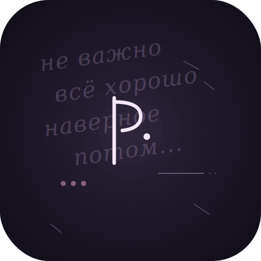

<div align="center">



# Palimpsest
### зеркало умолчаний

*Визуализация того, чего вы не договорили*

[](https://python.org)
[](LICENSE)
[]()
[]()
[]()

[Что это](#-что-это)  •
[Требования](#-требования)  •
[Установка](#-установка)  •
[Использование](#-использование)  •
[Версии](#-версии-анализа)  •
[Этика](#%EF%B8%8F-этическая-позиция)

</div>

---

> *Палимпсест — древний манускрипт, на котором старый текст стёрт, чтобы написать новый. Но под слоем чернил остаются следы прошлого.*

## ◐ Что это

**Palimpsest анализирует не то, что вы написали, а то, чего вы не договорили.**

Все существующие инструменты sentiment-анализа смотрят на присутствие эмоций в тексте: «вы были на 73% грустны в марте». Palimpsest делает наоборот — он смотрит на **отсутствия**, **дыры** и **умолчания**. На то, где человек останавливал сам себя.

Программа берёт ваш дневник или переписку и превращает её в **генеративный портрет** — абстрактное изображение, в котором цвет, плотность мазков и геометрия определяются паттернами вашей самоцензуры, а не содержанием слов.

Это не инструмент для измерения настроения. Это **визуальный портрет внутренней цензуры** — того, кем человек был бы, если бы писал честнее.

### Суть проекта

Palimpsest задаёт другой вопрос: **что вы НЕ сказали?**

- Многоточия в местах, где мысль обрывается
- «Не грустно», «всё нормально», «просто устал» — отрицания вместо признаний
- Эмоциональные крючки одного человека, которые другой не подхватил
- Длинные сообщения, на которые приходит односложный ответ
- Темы, к которым возвращаются снова и снова, но всегда обходят стороной

Это не предсказание чувств. Это **зеркало структуры умолчания** — того, как именно человек выбирает не говорить.

---

## 📦 Требования

### Системные

- **Python 3.8+** (рекомендуется Python 3.11 или новее)
- **ОС:** Windows 10/11, macOS, Linux
- **Память:** ~50 МБ
- **Диск:** ~5 МБ для проекта + место для портретов

### Зависимости Python

| Библиотека | Зачем | Установка |
|------------|-------|-----------|
| `Pillow` | Рендеринг изображений и иконок | `pip install pillow` |
| `numpy` | Value noise для пергаментных текстур | `pip install numpy` |
| `tkinter` | GUI | Входит в Python из коробки |
| `ctypes` | Тёмная title-bar на Windows 11 | Стандартная библиотека |

**Никаких ML-моделей. Никаких API. Никакого облака. Всё работает локально.**

### Шрифты

- **Windows 11**: используется системный **Segoe UI**, моно — **Cascadia Code**
- **Linux**: рекомендуется **DejaVu Sans** (обычно установлен по умолчанию)
- **macOS**: автоматический fallback на системные шрифты

Для подписей дат на графиках кириллицей нужен шрифт с её поддержкой. На Windows скрипт может потребовать ручной правки пути к шрифту — см. раздел [Кириллица](#кириллица-в-подписях-графика).

---

## 🚀 Установка

### Шаг 1. Клонировать репозиторий

```bash
git clone https://github.com/Cruitac345/palimpsest.git
cd palimpsest
```

или скачать ZIP и распаковать.

### Шаг 2. Установить зависимости

```bash
pip install pillow numpy
```

### Шаг 3. Запустить

**GUI (рекомендуется для Windows-пользователей):**

```bash
python palimpsest_gui.py
```

**CLI (для тех, кто работает в терминале):**

```bash
python palimpsest_v3.py examples/chat_sample.txt
```

---

## 💡 Использование

### Через GUI

<div align="center">

| Шаг | Действие |
|-----|----------|
| **1** | Нажмите **«Открыть файл»** или **«Вставить текст»** |
| **2** | Выберите версию анализа: **v1 / v2 / v3** |
| **3** | Нажмите **«◆ Запустить анализ»** |
| **4** | Посмотрите портрет на вкладке **«🎨 Портрет»** |
| **5** | Прочитайте отчёт на вкладке **«📜 Отчёт»** |
| **6** | Нажмите **«💾 Сохранить портрет»**, если хотите оставить картинку |

</div>

### Через CLI

**Для дневникового текста (v1, v2):**

Реплики разделяются пустой строкой:

```
Сегодня был... ну, обычный день. Всё нормально.
Хотел сказать ему, что... не важно.

Иногда думаю о том лете. Когда мы ещё... неважно уже.

Заснуть не получается третью ночь. Норм, бывает.
```

Запуск:

```bash
python palimpsest.py diary.txt           # v1: базовый
python palimpsest_v2.py diary.txt        # v2: с контекстом
```

**Для переписки (v3):**

Структурированный формат:

```
[2026-04-25] Анна: Привет! Давно не виделись...

[2026-04-25] Борис: Привет! Да, очень) Как дела?

[2026-04-25] Анна: Нормально
```

Запуск:

```bash
python palimpsest_v3.py chat.txt
```

На выходе:

- 📊 **Текстовый отчёт** в терминал
- 🖼 **PNG-портрет** рядом с входным файлом

---

## 🔍 Версии анализа

| Версия | Идея | Что нового |
|--------|------|------------|
| **v1**  ·  Базовый | Найти умолчания | Многоточия, оборванные фразы, отрицания эмоций. Генеративная абстракция |
| **v2**  ·  Контекстный | Различать типы молчания | Холод vs тёплое умолчание vs формальная вежливость. Палитра по тону |
| **v3**  ·  Динамика и асимметрия | Время и честность | Таймлайн, поворотные точки, реципрокность, прогноз, **этический модуль** |

### Что показывает v3

<details>
<summary><b>Базовая асимметрия</b> — кто пишет больше, кто отвечает быстрее</summary>

- Объём реплик в словах и сообщениях
- Кто инициирует темы (длинные сообщения)
- Средняя и максимальная задержка ответа
- Распределение «шагов к близости» и «шагов назад»

</details>

<details>
<summary><b>Поворотные точки</b> — моменты, где история повернула</summary>

- 🔄 Переход с «вы» на «ты»
- 💗 Первое сердце ❤️
- 😄 Вспышка смеха в ответ на длинную реплику
- ⏸ Долгая пауза после эмоционального сообщения

</details>

<details>
<summary><b>Реципрокность</b> — кто отзеркаливает, кто ведёт независимую линию</summary>

Корреляция Пирсона между тоном собеседника и тоном вашего ответа:

- `r > +0.5` — сильно подстраиваетесь под тон собеседника
- `r ≈ 0` — отвечаете независимо от тона
- `r < -0.5` — отвечаете противоположно (зеркальная инверсия)

</details>

<details>
<summary><b>Избегаемые темы</b> — где эмоциональные крючки не подхватывались</summary>

Если один человек кидает эмоциональный маркер («спасибо», «рад», «надеюсь»), а другой отвечает короткой нейтральной репликой — это фиксируется. Систематическое избегание = норма косвенного общения.

</details>

<details>
<summary><b>Прогноз траектории</b> — куда движутся отношения</summary>

- ▲ ВОСХОДЯЩИЙ — тепло растёт, есть поворотные точки
- ▲▽ СДЕРЖАННОЕ СБЛИЖЕНИЕ — тепло растёт, темп замедляется
- → ПЛАТО — стабильный тон без сдвигов
- ▽ НИСХОДЯЩИЙ — тепло уходит

</details>

<details>
<summary><b>Этический модуль</b> — когда метрики могут вводить в заблуждение</summary>

Распознаёт **институциональную асимметрию** (учебный/рабочий/медицинский контекст, обращения «Имя Отчество», систематическое «вы») и выводит предупреждение, что в таких контекстах:

- Сердечки в праздничных сообщениях — стандартная вежливость
- «Всё для вас)» от куратора — часть профессиональной роли
- Быстрые ответы — проявление профессионализма, а не эмоций

См. раздел [Этическая позиция](#%EF%B8%8F-этическая-позиция).

</details>

---

## ⚙️ Конфигурация

### Кириллица в подписях графика

Скрипт ищет шрифт `DejaVu Sans` (стандарт на Linux). На Windows / macOS откройте `palimpsest_v3.py`, найдите строки с `DejaVuSans.ttf` и замените путь:

```python
# Windows
"C:/Windows/Fonts/arial.ttf"
# macOS
"/System/Library/Fonts/Supplemental/Arial.ttf"
```

### Тёмная title-bar на Windows 11

Включается автоматически через `DwmSetWindowAttribute` в GUI. Если не работает — убедитесь, что у вас Windows 11 build 22000+ и Python запущен не в режиме совместимости.

---

## 📁 Структура проекта

```
palimpsest/
├── palimpsest_gui.py              # GUI на Tkinter в стиле Windows 11
├── palimpsest.py                  # v1: базовый анализ
├── palimpsest_v2.py               # v2: контекстный
├── palimpsest_v3.py               # v3: динамика, асимметрия, этика
├── palimpsest_assets/
│   ├── logo.png                   # логотип в PNG
│   └── logo.svg                   # логотип в SVG
├── examples/
│   ├── diary_sample.txt           # пример дневника
│   └── chat_sample.txt            # пример переписки
├── ANALYSIS.md                    # пример нарративного разбора
├── LICENSE                        # MIT-лицензия
└── README.md                      # этот файл
```

---

## ⚖️ Этическая позиция

**Palimpsest предназначен для размышления, а не для расшифровки чужих чувств.**

В процессе разработки стало ясно, что красивые метрики и уверенные прогнозы могут стать опасными, когда применяются к перепискам с **институциональной асимметрией** — преподаватель/студент, начальник/подчинённый, врач/пациент, секретарь/клиент.

В таких контекстах:

- ❤️ в праздничном поздравлении — стандартная вежливость, не признание
- «Всё для вас)» от куратора — часть профессиональной роли
- Быстрые ответы — проявление этики работы с людьми, а не эмоциональной вовлечённости

**Алгоритм считает корреляции эмодзи и задержки ответов. Он не умеет отличить симпатию от профессионализма.** Эту разницу может установить только сам человек — через прямой уважительный разговор при условии, что у собеседника есть свобода ответить «нет» без последствий для его роли.

### ✓ Подходит для

- Анализа собственных дневниковых записей
- Размышлений о собственных паттернах самоцензуры
- Исследования публичных текстов (литература, переписка исторических лиц)
- Симметричных переписок между друзьями / партнёрами с обоюдного согласия

### ✗ Не подходит для

- «Расшифровки» сообщений другого человека без его ведома
- Анализа переписок с участием людей в институционально подчинённой роли
- Принятия решений о действиях в чужом отношении к вам

V3 содержит обязательный этический модуль, который при обнаружении институциональных маркеров автоматически выводит предупреждение в конце отчёта.

---

## 🤝 Вклад

Идеи для развития:

- [ ] Поддержка короткомасштабных диалогов (минуты вместо дней)
- [ ] Анализ групповых переписок (3+ участника)
- [ ] Импорт из Telegram / WhatsApp / iMessage экспортов
- [ ] Интерактивный таймлайн (наведение на точку → текст реплики)
- [ ] Сравнение нескольких периодов одной переписки
- [ ] macOS-версия GUI с нативным acrylic-эффектом
- [ ] Расширение этического модуля на новые контексты

PRs приветствуются — особенно те, что усиливают **этическую часть** или добавляют новые форматы импорта.

### Как внести вклад

1. Форкните репозиторий
2. Создайте ветку для фичи: `git checkout -b feature/amazing-feature`
3. Закоммитьте изменения: `git commit -m 'Add amazing feature'`
4. Запушьте в ветку: `git push origin feature/amazing-feature`
5. Откройте Pull Request

---

## 📄 Лицензия

Этот проект распространяется под лицензией **MIT** — подробности в файле [LICENSE](LICENSE).

**Коротко:** делайте с кодом что хотите, но указывайте оригинального автора и не используйте этот инструмент для расшифровки чужих чувств в институционально-неравных контекстах (см. [Этическую позицию](#%EF%B8%8F-этическая-позиция)).

---

## 👤 Автор

**Cruitac345**

- GitHub: [@Cruitac345](https://github.com/Cruitac345)

---

## 🙏 Благодарности

Спасибо всем, кто итерировал этот проект вместе со мной — особенно тому, кто задал важный вопрос: «Можно ли учитывать этические нормы?» — и тем самым превратил красивый инструмент в честный.

---

<div align="center">

### *«Программа должна знать, чего она не знает»*

<sub>Palimpsest · v1.0.0 · Made with care by Cruitac345</sub>

</div>
